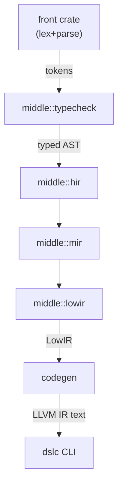

# dslc: Typed DSL to LLVM IR

The repository implements a small, expression-oriented language and walks it
through a multi-stage Rust pipeline:

```
front (lexer/parser/AST)
    → middle::typecheck
    → middle::hir → mir → lowir
    → codegen (textual LLVM IR)
    → dslc (CLI + llvm-as/lli runner)
```

The workspace mirrors those layers so each pass can evolve in isolation and be
reused programmatically (tests, editors, other binaries).

## Architecture overview



At runtime the CLI delegates to `dsl_driver::Compiler`, which orchestrates this
pipeline, caches each intermediate representation, and exposes dump methods for
other tools.

## Workspace layout

| Crate | Responsibility |
|-------|----------------|
| `crates/front` | Spans, tokens, lexer, parser, and AST definitions |
| `crates/middle` | Semantic passes: type checking plus placeholder `hir`, `mir`, `lowir` stages |
| `crates/codegen` | Consumes `lowir` and emits textual LLVM IR |
| `crates/driver` | High-level `Compiler` API that orchestrates the stages and exposes dumps |
| `crates/dslc` | End-user CLI that loads files, prints dumps, and shells out to LLVM tools |

`examples/foo.dsl` exercises the entire stack and returns `0` so it is safe for
`dslc --run` smoke tests.

## Getting started

1. Install the latest stable Rust toolchain.
2. Ensure LLVM tools (`llvm-as`, `lli`) are in your `PATH` for the `--run` mode.
3. Build and run the CLI:

   ```bash
   cargo run -p dslc -- --help
   cargo run -p dslc -- examples/foo.dsl --emit-llvm
   cargo run -p dslc -- examples/foo.dsl --run
   ```

`dslc --help` prints the supported flags:

```
Usage: dslc [OPTIONS] <FILE>

Options:
      --dump-tokens  Dump lexed tokens as debug output
      --dump-ast     Dump the parsed AST using Debug formatting
      --typecheck    Explicitly print a success message after typechecking
      --emit-llvm    Emit textual LLVM IR for the input program
      --run          Pipe LLVM IR through `llvm-as` + `lli` and execute it
```

## Development tips

- Run `cargo test` in the workspace root to exercise all crates.
- Each crate keeps its surface minimal so you can import only what you need; the
  driver crate re-exports the most common items.
- `Compilation` (from `dsl_driver`) caches tokens, AST, HIR, MIR, LowIR, and the
  final LLVM IR so tooling can inspect any stage without recomputation.

## Roadmap

- Flesh out the placeholder `hir`/`mir`/`lowir` structures with real
  transformations and add dump flags in the CLI.
- Add preprocessing/desugaring passes (e.g., `include`, block normalization).
- Extend codegen to emit Inkwell builders once the textual backend is stable.
- Integrate diagnostics tooling (codespan/miette) for richer errors.
